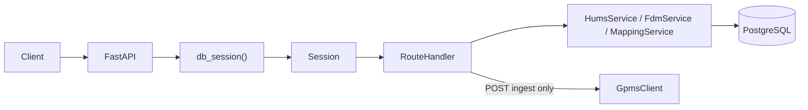

# `app/api` — REST layer

FastAPI routers and dependency injection. **Almost every GET reads Postgres only**; the exception is `POST .../ingest`, which calls GPMS live via `FdmService`.

Routers are registered in `app/main.py` (not in this package). OpenAPI metadata lives in `app/openapi_config.py`.

## Layout

```
app/api/
├── deps.py              # DB session FastAPI dependency
└── routes/
    ├── health.py        # GET /health
    ├── aircraft.py      # mappings + aircraft summary
    ├── hums.py          # HUMS (global + per-customer)
    ├── events.py        # critical alarms
    ├── fdm.py           # FDM operations / exportstates / ingest
    └── admin.py         # customers + mappings CRUD
```

## Request flow



| Layer | Responsibility |
|-------|----------------|
| **Route** | HTTP status codes, query/path params, `response_model` |
| **Service** | Business logic, GPMS calls (ingest/polls only from jobs + ingest) |
| **Schema** | JSON shape validation and serialization |

## `deps.py`

| Symbol | Role |
|--------|------|
| `db_session()` | Thin wrapper: `yield from get_db()` (`app/db.py`). Injected as `db: Session = Depends(db_session)` on every route that touches the database. |

One session per request; closed in `get_db()` finally block.

## `routes/health.py`

| Endpoint | Handler | Dependencies |
|----------|---------|--------------|
| `GET /health` | `health()` | `get_settings()`, `check_db_connection()` |

Returns `status`, sanitized `database` label (host/port/db from `DATABASE_URL`), and `db_connected`. Never calls GPMS.

## `routes/aircraft.py`

Prefix: `/api`. Tags: `mappings`, `aircraft`.

| Endpoint | Handler | Delegates to |
|----------|---------|--------------|
| `GET /api/mappings` | `list_mappings` | `MappingService.list_active_mappings()` → `AssetMappingOut` |
| `GET /api/aircraft` | `list_aircraft` | `FdmService.list_mapped_aircraft()` |
| `GET /api/aircraft/{asset_id}` | `get_aircraft` | `FdmService.get_mapped_aircraft()` → **404** if unmapped or not in list |

`CachedAircraft` merges mapping tail numbers with `hums_status_current` and FDM operation counts. A mapped asset with no HUMS poll yet still appears (`hums_cached=false`).

## `routes/hums.py`

Two routers (both registered in `main.py`):

| Router | Prefix | Endpoints |
|--------|--------|-----------|
| `gpms_router` | `/api` | `GET /api/hums` |
| `customer_router` | `/api/customers` | `GET /api/customers/{customer_id}/hums` |

| Handler | Logic |
|---------|--------|
| `get_gpms_hums` | `HumsService.list_mapped()` |
| `get_customer_hums` | Loads `Customer`; **404** if missing or `uses_gpms=false`; else `HumsService.list_for_customer()` |

Never polled assets show `mdstatus`/`rtbstatus` = `"pending"`.

## `routes/events.py`

Prefix: `/api`.

| Endpoint | Handler | Service call |
|----------|---------|--------------|
| `GET /api/events/critical` | `critical_events_all` | `HumsService.critical_events()` |
| `GET /api/customers/{id}/events/critical` | `critical_events_for_customer` | `HumsService.critical_events(customer_id=...)` |

Customer route does not re-check `uses_gpms` in the route (service returns `[]` if disabled). **Alarms only** — `mdstatus` or `rtbstatus` must be exactly `"alarm"` (warnings excluded). One aircraft can yield two events (MD + RTB).

## `routes/fdm.py`

Prefix: `/api/fdm`. Tag: `fdm`.

Shared guard: `_require_mapped(db, asset_id)` → **404** if `MappingService.get_mapping_for_asset` is `None`.

| Endpoint | Handler | Notes |
|----------|---------|-------|
| `GET .../aircraft` | `list_aircraft` | Same as `/api/aircraft` |
| `GET .../aircraft/{id}` | `get_aircraft` | Mapped + `FdmService.get_mapped_aircraft` |
| `GET .../operations` | `list_operations` | `limit` query (default 100), newest first |
| `POST .../ingest` | `ingest_operation` | **Live GPMS**; idempotent `already_ingested`; **502** on `GpmsApiError`, **404** on `KeyError` |
| `GET .../exportstates` | `get_exportstates` | `FdmExportReport`; `row_limit` default 500 |
| `GET .../exportstates/raw` | `get_exportstates_raw` | `PlainTextResponse` — full `raw_csv` |
| `GET .../states` | `get_states` | Paginated `FdmStateRow` or `FdmStateRowFull` when `full=true` |

## `routes/admin.py`

Prefix: `/api/admin`. **No authentication** — intended for dev/admin behind network controls.

| Endpoint | Handler | DB access |
|----------|---------|-----------|
| `POST /customers` | `create_customer` | Query params `name`, `uses_gpms` → `Customer` |
| `PATCH /customers/{id}/gpms` | `set_gpms_enabled` | `enabled` query param |
| `GET /mappings` | `list_all_mappings` | All mappings including `is_active=false` |
| `GET /customers/{id}/mappings` | `list_mappings` | Filter by `customer_id` |
| `POST /mappings` | `create_mapping` | Body `AssetMappingCreate`; **409** duplicate `gpms_asset_id` |

Admin mapping list bypasses `MappingService` (direct SQLAlchemy `select`).

## How routes connect to services

```
health.py          → app.db.check_db_connection, app.config
aircraft.py        → MappingService, FdmService
hums.py            → HumsService (+ Customer model for gate)
events.py          → HumsService
fdm.py             → MappingService, FdmService, GpmsApiError
admin.py           → Customer, GpmsAssetMapping (ORM), schemas.mapping
```

**Poll jobs never go through `app/api`** — they call `HumsService` / `FdmService` directly from `app/jobs`.

## Error conventions

| Situation | Typical code |
|-----------|----------------|
| Unmapped GPMS asset on FDM routes | 404 |
| Customer not found / GPMS disabled (HUMS customer route) | 404 |
| Duplicate mapping | 409 |
| GPMS upstream failure on ingest | 502 |
| Operation not in DB yet | 404 |

## Related docs

- [`app/services/README.md`](../services/README.md) — poll/ingest implementation
- [`app/schemas/README.md`](../schemas/README.md) — response models
- [`app/models/README.md`](../models/README.md) — tables
