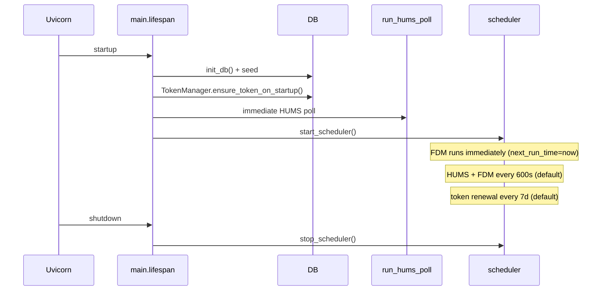

# `app/jobs` — Background polling

APScheduler jobs that keep the PostgreSQL cache fresh. **Scope is always active rows in `gpms_asset_mappings`** — not the full GPMS fleet.

Entry points are thin: open a DB session, delegate to a service, log, rollback on failure.

## Layout

```
app/jobs/
├── __init__.py          # Package docstring (poll summary)
├── scheduler.py         # start/stop BackgroundScheduler
├── hums_poll.py         # run_hums_poll → HumsService.poll_and_store
├── fdm_poll.py          # run_fdm_poll → FdmService.poll_new_imports
└── token_renewal.py     # run_token_renewal → TokenManager
```

## Lifecycle (with `app/main.py`)



| When | What runs |
|------|-----------|
| App startup (before scheduler) | `run_hums_poll()` once |
| Scheduler start | `run_fdm_poll()` immediately (`next_run_time=now`) |
| Every `HUMS_POLL_INTERVAL_SECONDS` | `run_hums_poll` |
| Every `FDM_POLL_INTERVAL_SECONDS` | `run_fdm_poll` |
| Every `GPMS_TOKEN_RENEWAL_DAYS` | `run_token_renewal` |

Manual equivalent: `python scripts/run_poll_once.py` (no scheduler wait).

## `scheduler.py`

| Function | Behavior |
|----------|----------|
| `start_scheduler()` | Singleton `BackgroundScheduler(timezone="UTC")`. Registers three interval jobs with `replace_existing=True`. Stores global `_scheduler`. |
| `stop_scheduler()` | `shutdown(wait=False)` on app teardown. |

Job IDs: `hums_poll`, `fdm_poll`, `token_renewal`.

Intervals come from `app.config.Settings` (`get_settings()`).

## `hums_poll.py`

```python
run_hums_poll() → SessionLocal → HumsService(db).poll_and_store() → commit inside service
```

| Detail | Value |
|--------|--------|
| GPMS endpoint | `GET /user/assets/{id}` per active mapping |
| Writes | `hums_status_current`, `hums_status_snapshots`, may update `gpms_asset_mappings.gpms_asset_name` |
| Per-asset failure | Logged; other assets still processed; outer `commit` at end of `poll_and_store` |
| Outer exception | `db.rollback()` in job wrapper |

Does **not** fetch operations or CSV.

## `fdm_poll.py`

```python
run_fdm_poll() → SessionLocal → FdmService(db).poll_new_imports()
```

| Phase | GPMS | DB effect |
|-------|------|-----------|
| **Backfill** (`fdm_ingest_cursors` missing or `backfill_complete=false`) | `GET .../operations?limit=FDM_OPERATIONS_FETCH_LIMIT` | Lists up to 500 ops (default); sets `backfill_complete` when fewer than limit returned |
| **Incremental** (`backfill_complete=true`) | `GET .../newimports?start=` from `last_checked_at` | Operation IDs only |
| **Per new op** | `GET .../exportstates/{opId}` via `ingest_operation` | `fdm_operations`, `fdm_state_samples`; skips existing `(asset_id, operation_id)` |

Per-asset failure in `_poll_asset_imports` rolls back that asset’s partial work; cursor still advanced on success path.

**Important:** Already-ingested operations are never re-downloaded. Backfill does **not** pull flights older than the newest N operations returned by GPMS.

## `token_renewal.py`

```python
run_token_renewal() → TokenManager.should_renew_proactively() → get_valid_token(force_refresh=True)
```

Proactive refresh when `gpms_auth_tokens.updated_at` is older than `GPMS_TOKEN_RENEWAL_DAYS`. Uses the same threaded lock as on-demand token fetch (see services README).

Jobs also call `get_valid_token()` on every poll; renewal job avoids waiting until JWT expiry.

## Session and transaction pattern

Each job:

1. `SessionLocal()`
2. Service method (may `commit` internally — `FdmService.ingest_operation` commits per operation)
3. On uncaught exception: `rollback()` in job `except`
4. `db.close()` in `finally`

`HumsService.poll_and_store` commits once after all assets. `FdmService.poll_new_imports` commits per ingested operation inside `ingest_operation` and again when updating `fdm_ingest_cursors`.

## Configuration

| Env var | Default | Job |
|---------|---------|-----|
| `HUMS_POLL_INTERVAL_SECONDS` | 600 | `hums_poll` |
| `FDM_POLL_INTERVAL_SECONDS` | 600 | `fdm_poll` |
| `GPMS_TOKEN_RENEWAL_DAYS` | 7 | `token_renewal` |
| `FDM_OPERATIONS_FETCH_LIMIT` | 500 | FDM backfill only |
| `GPMS_EMAIL` / `GPMS_PASSWORD` | — | Required for polls to succeed |

## Related docs

- [`app/services/README.md`](../services/README.md) — `poll_and_store`, `poll_new_imports`, `ingest_operation`
- [`app/models/README.md`](../models/README.md) — `fdm_ingest_cursors`, HUMS tables
