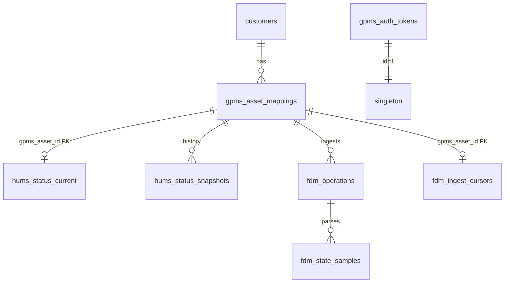

# `app/models` — SQLAlchemy ORM

Declarative models on `app.db.Base`. Imported in `app/models/__init__.py` so Alembic and `init_db()` register all tables.

Schema source of truth for migrations: `alembic/versions/001_initial_schema.py`.

## Entity relationship



## Poll and API scope

**`gpms_asset_mappings.is_active = true`** defines:

- Which GPMS asset IDs `HumsService` / `FdmService` polls hit
- Which aircraft appear on `/api/hums`, `/api/aircraft`, `/api/fdm/*`, `/api/events/critical`

Inactive mappings are visible only via `GET /api/admin/mappings`.

---

## `customer.py` — `Customer`

| Table | `customers` |
|-------|-------------|
| PK | `id` |
| Fields | `name`, `uses_gpms` (default `false`) |
| Relationship | `asset_mappings` → `GpmsAssetMapping` |

`uses_gpms` gates customer-scoped HUMS routes (`/api/customers/{id}/hums`). Admin can toggle via `PATCH /api/admin/customers/{id}/gpms`.

---

## `mapping.py` — `GpmsAssetMapping`

| Table | `gpms_asset_mappings` |
|-------|----------------------|
| Constraint | `uq_gpms_asset_id` — one Brazos row per GPMS asset |
| Index | `gpms_asset_id` |

| Column | Purpose |
|--------|---------|
| `customer_id` | FK → `customers.id` |
| `gpms_asset_id` | GPMS Foresight asset ID (poll key) |
| `gpms_fleet_id` | Optional metadata |
| `brazos_tail_number` | Brazos tail (display / CSV filename) |
| `gpms_asset_name` | Filled/updated from HUMS poll |
| `is_active` | Poll + public API scope |

Seeded default: asset `223` → `N407NW` (`app/seed.py`).

---

## `auth.py` — `GpmsAuthToken`

| Table | `gpms_auth_tokens` |
|-------|-------------------|
| Rows | **Single row** `id = 1` |

| Column | Purpose |
|--------|---------|
| `token` | Bearer JWT for `GpmsClient` |
| `expires_at` | From JWT `exp` claim (or fallback) |
| `updated_at` | Drives proactive renewal job |

Written only by `TokenManager` — not exposed via REST.

---

## `hums.py` — HUMS cache

### `HumsStatusCurrent`

| Table | `hums_status_current` |
| PK | `gpms_asset_id` |

Latest health per mapped asset. Updated on every successful HUMS poll.

| Column | GPMS source |
|--------|-------------|
| `mdstatus`, `mdmax` | Motor drive health |
| `rtbstatus`, `rtbhealth` | RTB health |
| `last_operation_date` | Last flight timestamp |
| `polled_at` | When this row was written |
| `asset_name`, `fleet_id` | Asset metadata |

### `HumsStatusSnapshot`

| Table | `hums_status_snapshots` |
| PK | `id` (auto) |

Append-only copy of the same fields on **every** poll. **No read API yet** — intended for reporting/trending later.

`HealthStatus` type alias: `"normal" | "warning" | "alarm"` (stored as strings).

---

## `fdm.py` — FDM cache

### `FdmOperation`

| Table | `fdm_operations` |
| Constraint | `uq_asset_operation` (`gpms_asset_id`, `operation_id`) |

| Column | Purpose |
|--------|---------|
| `start_time`, `end_time`, `flight_time` | From GPMS operations API when available |
| `ingested_at` | UTC ingest timestamp |
| `source_filename` | e.g. `N407NW_2024-01-15_143022_STATES.csv` |
| `raw_csv` | Full exportstates CSV text |

### `FdmStateSample`

| Table | `fdm_state_samples` |

One row per CSV data row (~2 s sampling). ~36 numeric/geo columns mapped from GPMS headers via `app/services/csv_ingest.HEADER_MAP`.

Keyed logically by `(gpms_asset_id, operation_id, row_index)`.

### `FdmIngestCursor`

| Table | `fdm_ingest_cursors` |
| PK | `gpms_asset_id` |

| Column | Purpose |
|--------|---------|
| `last_checked_at` | Passed to `newimports` as `start` after backfill |
| `backfill_complete` | `false` → use operations list; `true` → use `newimports` |

Created/updated at end of each FDM poll per asset.

---

## `__init__.py` exports

```python
Customer, GpmsAssetMapping, GpmsAuthToken,
HumsStatusCurrent, HumsStatusSnapshot,
FdmOperation, FdmStateSample, FdmIngestCursor
```

## Who reads/writes what

| Model | Writers | Readers |
|-------|---------|---------|
| `Customer` | seed, admin routes | hums customer route, services |
| `GpmsAssetMapping` | seed, admin, `HumsService._update_mapping_name` | MappingService, all list endpoints |
| `GpmsAuthToken` | TokenManager | GpmsClient (via token string) |
| `HumsStatusCurrent` | HumsService.poll | HumsService, FdmService (aircraft summary), events |
| `HumsStatusSnapshot` | HumsService.poll | — |
| `FdmOperation` | FdmService.ingest | FDM API routes |
| `FdmStateSample` | csv_ingest via FdmService | FDM states/exportstates routes |
| `FdmIngestCursor` | FdmService._poll_asset_imports | — |

## Related docs

- [`app/services/README.md`](../services/README.md) — upsert/ingest logic
- [`app/schemas/README.md`](../schemas/README.md) — API shapes built from these rows
