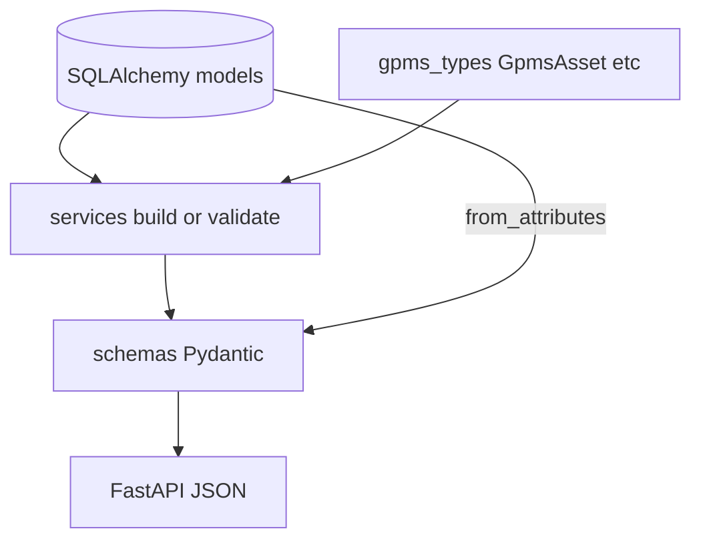

# `app/schemas` — Pydantic API contracts

Request/response models for FastAPI `response_model` and admin POST bodies. **Not** GPMS wire types (those live in `app/services/gpms_types.py`).

Datetime fields use `app.time_utils.OptionalUtcDatetime` / `UtcDatetime` — JSON serializes with `Z` suffix.

## Layout

```
app/schemas/
├── __init__.py      # Re-exports public models
├── mapping.py       # Admin mapping CRUD
├── aircraft.py      # Cached aircraft + export report
├── hums.py          # HUMS list items
├── events.py        # Critical alarms
└── fdm.py           # Operations + state rows
```

## Data flow



---

## `mapping.py`

| Model | Direction | Used by |
|-------|-----------|---------|
| `AssetMappingCreate` | Request body | `POST /api/admin/mappings` |
| `AssetMappingOut` | Response | `/api/mappings`, admin mapping routes |

`AssetMappingOut` has `model_config = {"from_attributes": True}` — maps directly from `GpmsAssetMapping` ORM rows.

`AssetMappingCreate` validates `brazos_tail_number` length (1–32).

---

## `aircraft.py`

### `CachedAircraft`

Combined view for `/api/aircraft` and `/api/fdm/aircraft`.

| Field | Source when `hums_cached=true` | When false |
|-------|----------------------------------|------------|
| `asset_id` | `gpms_asset_id` | mapping id |
| `brazos_tail_number` | mapping | mapping |
| HUMS fields | `hums_status_current` | `null` |
| `operation_count` | `COUNT(fdm_operations)` | same |
| `hums_cached` | `true` | `false` |

Built manually in `FdmService.list_mapped_aircraft()` (not `from_attributes`).

### `FdmExportReport`

Rich exportstates summary from `FdmService.get_exportstates_report()`:

| Field | Meaning |
|-------|---------|
| `csv_line_count`, `csv_byte_count` | From stored `raw_csv` |
| `csv_header` | First line of CSV or synthetic from `HEADER_MAP` |
| `raw_csv_preview` | First 6 lines |
| `rows` | List of dicts from `FdmStateRowFull.model_dump()` (up to `row_limit`) |

---

## `hums.py` — `HumsAircraftStatus`

| Field | Notes |
|-------|-------|
| `gpms_asset_id` | GPMS asset ID |
| `tail_number` | From mapping `brazos_tail_number` |
| `mdstatus`, `rtbstatus` | `"pending"` if never polled |
| `gpms_portal_url` | From `GPMS_PORTAL_ASSET_URL.format(asset_id=...)` if set |

Constructed in `HumsService.list_mapped()` — mixes mapping + `HumsStatusCurrent`.

---

## `events.py` — `CriticalEvent`

| Field | Notes |
|-------|-------|
| `metric` | `"MD"` or `"RTB"` |
| `status` | Always `"alarm"` in practice |
| `polled_at` | Required `UtcDatetime` |

One alarm on both MD and RTB → **two** `CriticalEvent` rows for the same asset.

---

## `fdm.py`

### `FdmOperationOut`

| Field | Notes |
|-------|-------|
| `is_ingested` | Always `true` in list API (only stored ops returned) |
| Times | `OptionalUtcDatetime` |

Built in `FdmService.list_operations()` from `FdmOperation` rows.

### `FdmStateRow` vs `FdmStateRowFull`

| Model | Columns | Route |
|-------|---------|-------|
| `FdmStateRow` | 10 fields (position, attitude, IAS subset) | `GET .../states` default |
| `FdmStateRowFull` | All 36 ingested columns | `GET .../states?full=true` |

Both use `from_attributes=True` on `FdmStateSample` ORM instances.

---

## `__init__.py`

Public re-exports for convenience:

`HumsAircraftStatus`, `CriticalEvent`, `CachedAircraft`, `FdmExportReport`, `FdmOperationOut`, `FdmStateRow`, `AssetMappingCreate`, `AssetMappingOut`

(`FdmStateRowFull` is imported only in `fdm.py` route via direct module import.)

---

## GPMS types vs API schemas

| Concern | Module |
|---------|--------|
| Raw GPMS JSON | `app/services/gpms_types.py` (`GpmsAsset`, `GpmsOperation`, …) |
| REST responses | `app/schemas/*` |
| Internal only | ORM models |

Example: `GpmsAsset.mdstatus` is normalized in `HumsService._upsert_asset` before landing in `HumsStatusCurrent`; API exposes `HumsAircraftStatus` with tail number and portal URL extras.

---

## Related docs

- [`app/api/README.md`](../api/README.md) — which schema each route returns
- [`app/time_utils.py`](../time_utils.py) — UTC validators used by schemas
