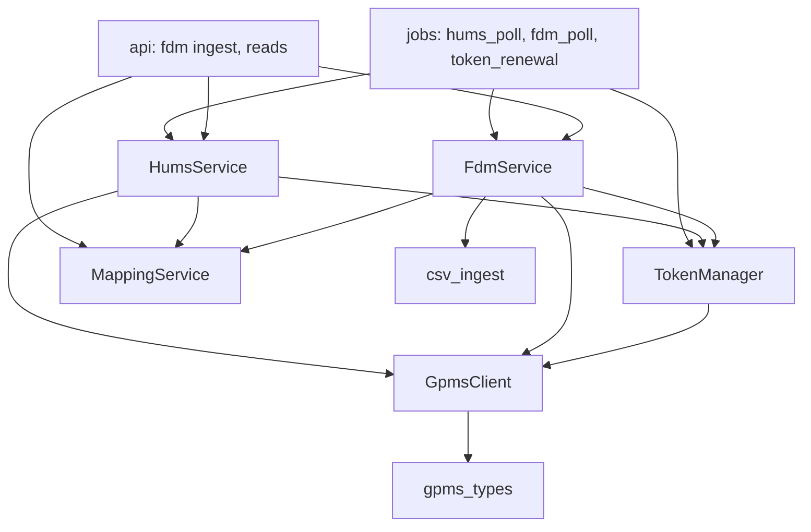
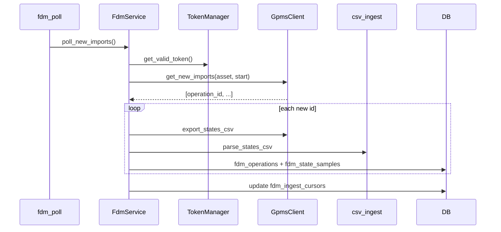

# `app/services` — Business logic and GPMS I/O

All GPMS HTTP traffic and ingest logic lives here. API routes and background jobs should call services rather than `GpmsClient` directly (except admin ORM shortcuts).

## Layout

```
app/services/
├── mapping_service.py   # Active mapping scope
├── token_manager.py     # JWT cache + renewal lock
├── gpms_client.py       # httpx GPMS API
├── gpms_types.py        # Pydantic GPMS JSON shapes
├── hums_service.py      # HUMS poll + read + critical events
├── fdm_service.py       # FDM poll, ingest, read
└── csv_ingest.py        # exportstates CSV → FdmStateSample
```

## Dependency graph



---

## `mapping_service.py` — `MappingService`

Central **scope guard** for polls and FDM routes.

| Method | Returns |
|--------|---------|
| `list_active_mappings()` | `GpmsAssetMapping[]` where `is_active` |
| `get_active_gpms_asset_ids()` | List of `gpms_asset_id` |
| `get_mapping_for_asset(id)` | Active mapping or `None` |
| `require_mapped_asset(id)` | Mapping or raises `KeyError` |

Used by both poll pipelines before any GPMS call.

---

## `token_manager.py` — `TokenManager`

| Method | Behavior |
|--------|----------|
| `get_valid_token(force_refresh=False)` | Returns cached JWT if `expires_at > now + 5min`; else renews under process-wide `_renew_lock` |
| `_renew(row)` | `GpmsClient.login()` → upsert `GpmsAuthToken` id=1 → `commit` |
| `ensure_token_on_startup()` | Best-effort token; swallows `GpmsApiError` if creds missing |
| `should_renew_proactively()` | True if no row or `updated_at` older than `GPMS_TOKEN_RENEWAL_DAYS` |

Expiry parsed from JWT `exp` via PyJWT (`verify_signature=False`); fallback adds `gpms_token_renewal_days`.

**Thread safety:** double-checked locking so concurrent polls don’t stampede `/auth/user`.

---

## `gpms_client.py` — `GpmsClient`

| Method | GPMS path | Used in production? |
|--------|-----------|---------------------|
| `login(settings)` | `POST /auth/user` | Yes (TokenManager) |
| `get_asset(id)` | `GET /user/assets/{id}` | HUMS poll |
| `get_operations(id, limit)` | `GET .../operations` | FDM backfill |
| `get_new_imports(id, start)` | `GET .../newimports` | FDM incremental |
| `export_states_csv(id, opId)` | `GET .../exportstates/{opId}` | Ingest (raw bytes) |
| `get_operation(id, opId)` | `GET .../operations/{opId}` | Ingest metadata |
| `get_fleets()` / `iter_assets()` | `GET /user/fleets` | **Helpers only — not used by jobs** |

Raises `GpmsApiError(message, status_code)` on HTTP ≥400 or login failures. Context manager closes `httpx.Client`.

120s timeout on authenticated client; 30s on login.

---

## `gpms_types.py`

Pydantic models for GPMS JSON (`extra="ignore"`):

- `GpmsAsset` — HUMS fields + `asset_id`
- `GpmsOperation` — flight metadata
- `GpmsFleet` — fleet list helper

Distinct from `app/schemas` (Brazos-facing API).

---

## `hums_service.py` — `HumsService`

### Write path: `poll_and_store() → int`

```
get_active_gpms_asset_ids()
→ TokenManager.get_valid_token()
→ for each id: GpmsClient.get_asset(id)
    → _upsert_asset(GpmsAsset)
    → _update_mapping_name (if asset_name present)
→ db.commit()
```

`_upsert_asset`:

- Upserts `HumsStatusCurrent` by `gpms_asset_id`
- Inserts new `HumsStatusSnapshot` every time
- Normalizes empty status to `"normal"`

### Read paths

| Method | Logic |
|--------|-------|
| `list_mapped(customer_id=None)` | Join mappings + `HumsStatusCurrent`; synthetic `"pending"` row |
| `list_for_customer(id)` | Empty if customer missing or `uses_gpms=false` |
| `critical_events(customer_id=None)` | `HumsStatusCurrent` where `mdstatus` or `rtbstatus` == `"alarm"`; filter by customer mappings |

`_portal_url(asset_id)` applies `GPMS_PORTAL_ASSET_URL` template.

---

## `fdm_service.py` — `FdmService`

### Read paths (DB only)

| Method | Notes |
|--------|-------|
| `list_mapped_aircraft()` | Mapping + HUMS + operation count → `CachedAircraft` |
| `get_mapped_aircraft(id)` | Filter from list |
| `list_operations(id, limit)` | Newest `start_time` first |
| `operation_exists` | Exists in `fdm_operations` |
| `get_state_rows(..., full)` | Paginated `FdmStateSample` |
| `get_exportstates_report` | Metadata + preview + parsed rows |
| `get_exportstates_raw` | `raw_csv` column |

### Write path: `ingest_operation(asset_id, operation_id, ...) → FdmOperation`

```
require_mapped_asset
→ if exists: return row
→ optional: get_operation() for start/end/flight_time
→ export_states_csv() → decode utf-8-sig
→ build_states_filename(tail, start_time)
→ insert FdmOperation + parse_states_csv → add_all samples
→ commit
```

Idempotent at DB level (`uq_asset_operation`).

### Poll path: `poll_new_imports() → int`

For each active `gpms_asset_id`:

```
_poll_asset_imports(client, id, limit)
```

**Backfill branch** (`cursor` null or `backfill_complete=false`):

1. `get_operations(limit)`
2. `operation_ids` = all returned IDs
3. `backfill_complete = len(ops) < limit`

**Incremental branch**:

1. `get_new_imports(start=last_checked_at ISO Z)`
2. `backfill_complete` stays true

For each `operation_id` not in DB: `ingest_operation(...)` with metadata from backfill map when available.

Updates `FdmIngestCursor.last_checked_at` to poll time; sets `backfill_complete` when appropriate.

Per-operation ingest failure: log + `rollback` that operation; continue others.

---

## `csv_ingest.py`

| Symbol | Role |
|--------|------|
| `HEADER_MAP` | GPMS CSV header (lowercase) → `FdmStateSample` column name |
| `parse_states_csv(bytes, gpms_asset_id, operation_id)` | `csv.DictReader` → list of `FdmStateSample` with `row_index` |
| `build_states_filename(tail, start_time)` | `{tail}_{UTC}_STATES.csv` |

`_normalize_header` falls back to snake_case for unknown columns. Timestamps via `parse_datetime`; numbers via `_parse_float`.

Shared with `FdmExportReport` for synthetic header line when CSV empty.

---

## End-to-end: one new flight (incremental poll)



---

## Error handling patterns

| Layer | Pattern |
|-------|---------|
| HUMS poll per asset | `logger.exception`; continue; single commit |
| FDM poll per asset | Outer `rollback` on asset failure |
| FDM ingest per op | `rollback`; skip op |
| API ingest | `GpmsApiError` → HTTP 502 |

---

## Related docs

- [`app/jobs/README.md`](../jobs/README.md) — when polls run
- [`app/api/README.md`](../api/README.md) — HTTP mapping
- [`app/models/README.md`](../models/README.md) — persistence
